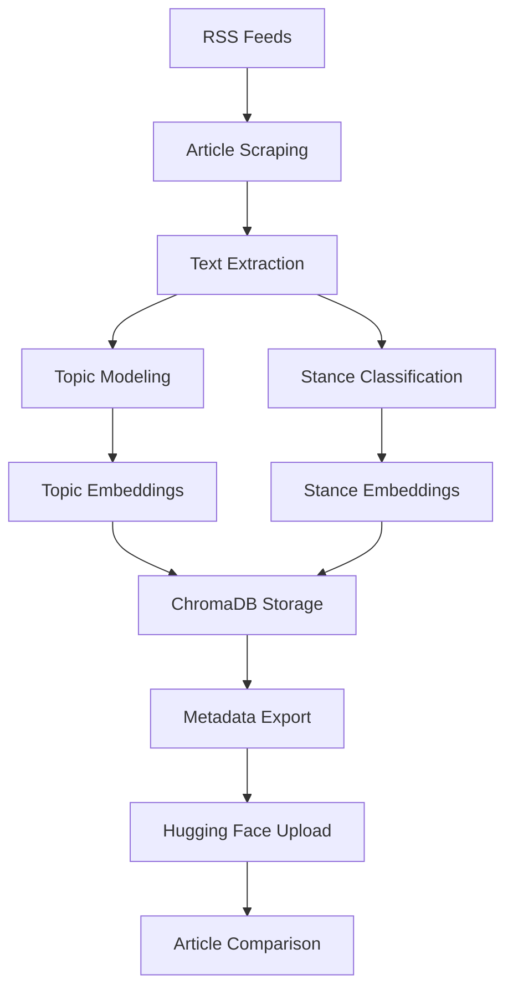

# Anti-Echo Chamber

A system for analyzing news articles across political spectrums to identify opposing viewpoints and break echo chambers.

## 🚀 Quick Start

### Open in Google Colab

| Notebook | Description | Colab Link |
|----------|-------------|------------|
| **Scraper & Processor** | Scrape news articles and process through the pipeline | [](https://colab.research.google.com/github/AHMerrill/anti-echo-2/blob/main/notebooks/scraper_artifacts.ipynb) |
| **Article Comparison** | Compare articles and find opposing viewpoints | [](https://colab.research.google.com/github/AHMerrill/anti-echo-2/blob/main/notebooks/anti_echo_chamber.ipynb) |

## 📁 Repository Structure

```
anti-echo-2/
├── anti_echo_core.py          # Core library with all processing functions
├── config/
│   ├── config.yaml           # Main configuration
│   ├── config_improved.yaml  # Enhanced configuration
│   ├── political_leanings.json
│   ├── implied_stances.json
│   └── topics.json
├── notebooks/
│   ├── scraper_artifacts.ipynb    # News scraping and processing
│   └── anti_echo_chamber.ipynb    # Article comparison and retrieval
├── requirements.txt
└── README.md
```

## 🔧 Features

### News Processing Pipeline
- **Multi-source scraping** from diverse RSS feeds (Fox News, NPR, BBC, etc.)
- **Topic modeling** using sentence transformers and clustering
- **Political stance classification** using FLAN-T5
- **Rhetorical summarization** using BART
- **Vector embeddings** for similarity matching

### Privacy-First Design
- **No full text storage** - only metadata and embeddings
- **Hugging Face integration** for sharing processed data
- **ChromaDB** for local vector storage and retrieval

### Anti-Echo Chamber Features
- **Opposing viewpoint detection** based on political leanings
- **Topic-based article matching** across political spectrums
- **Stance-aware retrieval** to find contrasting perspectives

## 🛠️ Installation

### Local Development
```bash
git clone https://github.com/AHMerrill/anti-echo-2.git
cd anti-echo-2
pip install -r requirements.txt
```

### Google Colab
Click the Colab badges above to open notebooks directly in Google Colab. The notebooks will automatically:
1. Install dependencies
2. Download the core library
3. Set up the processing pipeline

## 📊 Usage

### 1. Scraping and Processing
Use the **Scraper & Processor** notebook to:
- Scrape articles from diverse news sources
- Process through topic modeling and stance classification
- Upload metadata + embeddings to Hugging Face

### 2. Article Comparison
Use the **Article Comparison** notebook to:
- Query for similar articles by topic
- Find opposing viewpoints by political stance
- Analyze article similarities and differences

## 🔑 Configuration

The system uses several configuration files:

- **`config.yaml`** - Main configuration with model settings
- **`political_leanings.json`** - Political classification taxonomy
- **`implied_stances.json`** - Stance classification categories
- **`topics.json`** - Topic anchors for similarity matching

## 📈 Data Flow



## 🎯 Key Components

### Core Library (`anti_echo_core.py`)
- `AntiEchoCore` - Main processing class
- `process_article()` - Full article processing pipeline
- `query_similar_articles()` - Topic-based article retrieval
- `query_opposing_stance()` - Political stance-based retrieval
- `export_metadata_only()` - Privacy-safe data export

### Scraper Notebook
- Multi-source RSS feed scraping
- Content extraction using Trafilatura
- Batch processing through the pipeline
- Hugging Face dataset upload

### Comparison Notebook
- Article similarity analysis
- Opposing viewpoint detection
- Interactive article comparison
- ChromaDB query interface

## 🔒 Privacy & Ethics

- **No full text storage** - only embeddings and metadata
- **Source attribution** - all articles link back to original sources
- **Diverse sourcing** - balanced representation across political spectrums
- **Transparent processing** - all classification logic is open source

## 📚 Models Used

- **Topic Embeddings**: `intfloat/e5-base-v2`
- **Stance Embeddings**: `Snowflake/snowflake-arctic-embed-l`
- **Political Classification**: `google/flan-t5-large`
- **Summarization**: `facebook/bart-large-cnn`

## 🤝 Contributing

1. Fork the repository
2. Create a feature branch
3. Make your changes
4. Submit a pull request

## 📄 License

This project is open source and available under the MIT License.

## 🔗 Links

- **GitHub Repository**: https://github.com/AHMerrill/anti-echo-2
- **Hugging Face Dataset**: https://huggingface.co/datasets/anti-echo-chamber-data
- **Issues & Discussions**: https://github.com/AHMerrill/anti-echo-2/issues

---

**Note**: This system is designed to promote diverse viewpoints and break echo chambers. It processes news articles to identify opposing perspectives across political spectrums while maintaining privacy by only storing metadata and embeddings, not full article text.
